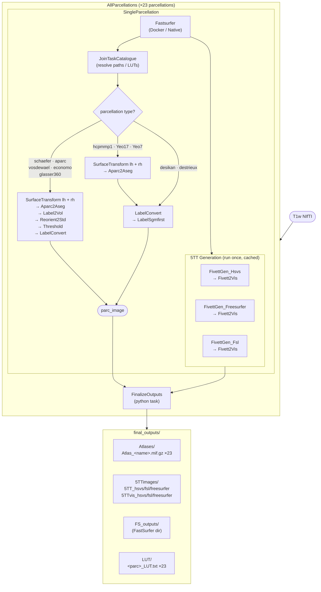

# AllParcellations Pipeline — Flow Diagram

**Notes:**
- Fastsurfer and the 5TT block each run once — pydra's cache reuses the result across all 23 `SingleParcellation` calls.
- `LabelSgmfirst` is shared by `desikan`, `destrieux`, `hcpmmp1`, `Yeo17`, and `Yeo7`.
- `FinalizeOutputs` receives all 23 `parc_image` outputs plus 5TT/vis/FS wired from the `desikan` run.
