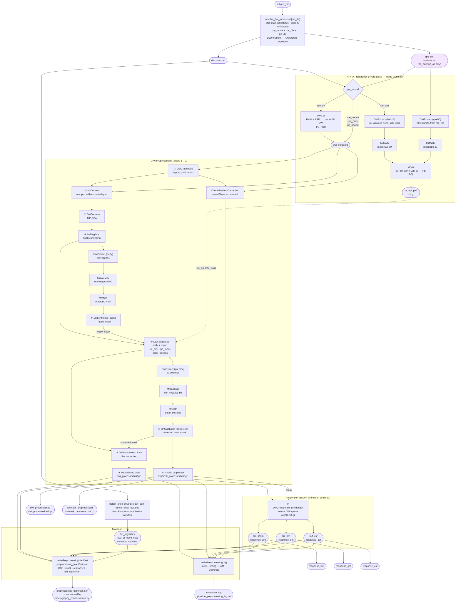

# DWI Preprocessing Pipeline



---

## Example Usage

### Auto-discovery from subject directory

```python
import datetime
from dwi_preprocessing import DwiPreprocessing, resolve_dwi_inputs, detect_shell_structure

subject_dir = "/data/subjects/100307"
output_path = "/data/output/100307_preproc"

inputs = resolve_dwi_inputs(subject_dir)
wf = DwiPreprocessing(
    **inputs,
    eddy_options="' --slm=linear'",
    fod_algorithm=detect_shell_structure(inputs["dwi_raw_mif"]),
    start_time=datetime.datetime.now().isoformat(timespec="seconds"),
    cache_root=output_path,
)
result = wf(cache_root=output_path, rerun=True)
```

---

## AP/PA preparation — what happens inside the workflow

| `rpe_mode`   | Pydra tasks added                                                                      | dwifslpreproc receives                                     |
|--------------|----------------------------------------------------------------------------------------|------------------------------------------------------------|
| `rpe_none`   | none — `dwi_raw_mif` passes straight through                                           | `-rpe_none -pe_dir`                                        |
| `rpe_pair`   | `DwiExtract` (fwd b0) → `MrMath` + `DwiExtract` (rpe b0) → `MrMath` → `MrCat`        | `-rpe_pair -se_epi <1+1 b0 pair> -align_seepi -pe_dir`    |
| `rpe_all`    | `DwiCat` — concatenates `dwi_raw_mif` + `rpe_file` (AP first)                         | `-rpe_all -pe_dir`                                         |
| `rpe_header` | none — PE info read from image header                                                  | `-rpe_header` (pe_dir and readout_time omitted)            |

---

## Key outputs consumed by `tractography_connectomics.py`

| File | Description |
|------|-------------|
| `preprocessing_manifest.json` | JSON index of all output paths and `fod_algorithm`; read by `resolve_tractography_inputs` |
| `dwi_processed.mif.gz` | Bias-corrected, cropped DWI in native DWI space |
| `dwimask_processed.mif.gz` | Corresponding brain mask |
| `response_wm/gm/csf` | Tissue response functions (native DWI space) — used by default in FOD estimation; overridable with group-averaged responses |
| `pipeline_preprocessing_log.txt` | Execution summary with timing, warnings, and step details |
