# Tractography & Connectomics Pipeline

```mermaid
flowchart TD
    %% ── Pre-workflow (plain Python) ──────────────────────────────────────────
    PREPROC_DIR(["preprocessed_dir<br/>(output of dwi_preprocessing.py)"])
    T1_DIR(["t1_dir<br/>(5TT · parcellations · FS_outputs)"])
    OPT_RESP(["response_wm / response_gm / response_csf<br/>(optional — all three or none)"]):::opt
    FTT_OPT(["ftt_method<br/>hsvs · fsl · freesurfer<br/>(default: hsvs)"]):::opt

    PREPROC_DIR --> RESOLVE["resolve_tractography_inputs()<br/>read preprocessing_manifest.json<br/>resolve response functions · discover 5TT · 5TTvis · parcellations · FS_outputs<br/><i>plain Python — runs before workflow</i>"]
    T1_DIR --> RESOLVE
    OPT_RESP --> RESOLVE
    FTT_OPT --> RESOLVE

    RESOLVE --> RESP_CHOICE{"response functions<br/>provided?"}
    RESP_CHOICE -- "yes — all 3<br/>(group-averaged)" --> RESP_RESOLVED(["response_wm / response_gm / response_csf"])
    RESP_CHOICE -- "no<br/>(use subject-specific)" --> RESP_RESOLVED
    RESP_CHOICE -- "1 or 2 provided" --> ERR(["ValueError"]):::err

    RESOLVE --> IN_DWI([dwi_preprocessed<br/>dwi_processed.mif.gz])
    RESOLVE --> IN_MASK([dwimask_preprocessed<br/>dwimask_processed.mif.gz])
    RESOLVE --> IN_FS([FS_dir])
    RESOLVE --> IN_FTT([fTT_image_T1space])
    RESOLVE --> IN_FTTVIS([fTTvis_image_T1space])
    RESOLVE --> IN_PARCS(["_parcellations<br/>(list — loop in __main__)"])

    %% ── Tractography workflow ────────────────────────────────────────────────
    subgraph TRACTOGRAPHY["Tractography workflow — runs once per subject"]

        subgraph FS["FreeSurfer Conversion (Step 1)"]
            IN_FS --> JOIN["JoinTask<br/>build FS file paths"]
            JOIN --> CVT1B["MrConvert<br/>brainmask.mgz → t1brain.nii.gz"]
            JOIN --> CVTNORM["MrConvert<br/>norm.mgz → normimg.nii.gz"]
            JOIN --> WMBIN["MrcalcMax<br/>wm.seg.mgz > 0 → WM binary mask"]
        end

        subgraph REG["Registration — DWI to T1 Space (Steps 2 – 6)"]
            IN_DWI --> B0EX["② DwiExtract<br/>b0 volumes"]
            B0EX --> B0NN["MrcalcMax<br/>non-negative b0"]
            B0NN --> MEANB0["MrMath<br/>mean b0 NIfTI"]
            MEANB0 --> EPIREG["④ EpiReg<br/>DWI → T1 registration"]
            CVTNORM --> EPIREG
            CVT1B --> EPIREG
            WMBIN -->|"wmseg"| EPIREG
            EPIREG --> TCONV["⑤ TransformConvert<br/>flirt_import → MRtrix3 .txt"]
            MEANB0 --> TCONV
            CVT1B --> TCONV
            TCONV --> TDWI["⑥ MrTransform<br/>DWI → T1 space<br/>DWI_T1space.mif.gz"]
            IN_DWI --> TDWI
            IN_FTTVIS -->|"template + strides"| TDWI
            TCONV --> TMASK["⑥ MrTransform<br/>mask → T1 space<br/>DWImask_T1space.mif.gz<br/>interp: nearest"]
            IN_MASK --> TMASK
            IN_FTTVIS -->|"template + strides"| TMASK
        end

        subgraph FOD_CALC["FOD Estimation + Normalisation in T1 Space (Steps 7 – 8)"]
            FOD_CHOICE{"fod_algorithm<br/>(from manifest)"}
            RESP_RESOLVED --> FOD_CHOICE
            FOD_CHOICE -- "ss3t<br/>(1 non-zero shell)" --> SS3T["⑦ Ss3tCsdBeta1<br/>ss3t_csd_beta1<br/>wm / gm / csf ODF"]
            FOD_CHOICE -- "msmt_csd<br/>(2+ non-zero shells)" --> MSMT["⑦ Dwi2Fod<br/>msmt_csd<br/>wm / gm / csf FOD"]
            TDWI --> SS3T
            TMASK --> SS3T
            TDWI --> MSMT
            TMASK --> MSMT
            SS3T --> NORM["⑧ MtNormalise<br/>wmfod_norm / gmfod_norm / csffod_norm"]
            MSMT --> NORM
            TMASK -->|"mask"| NORM
        end

        subgraph TCKSTEPS["Tractography + TDI (Steps 9 – 12)"]
            NORM --> TCKGEN["⑨ TckGen (iFOD2)<br/>probabilistic tractography<br/>seed_dynamic · ACT · backtrack · crop_gmwmi"]
            IN_FTT -->|"act"| TCKGEN
            TCKGEN --> SIFT2["⑩ TckSift2<br/>streamline weight optimisation<br/>out_mu · out_weights"]
            NORM -->|"fod_wm_norm"| SIFT2
            IN_FTT -->|"act"| SIFT2
            TCKGEN --> TDIMAP["⑪ TckMap (TDI)<br/>vox=1mm · SIFT2-weighted<br/>TDI.mif.gz"]
            SIFT2 -->|"tck_weights_in"| TDIMAP
            IN_FTT -->|"template"| TDIMAP
            TCKGEN --> DECTDI["⑫ TckMap (DEC-TDI)<br/>vox=1mm · SIFT2-weighted · dec<br/>DECTDI.mif.gz"]
            SIFT2 -->|"tck_weights_in"| DECTDI
            IN_FTT -->|"template"| DECTDI
        end

    end

    %% ── Tractography outputs ─────────────────────────────────────────────────
    TDWI --> OUT1([DWI_T1space<br/>DWI_T1space.mif.gz])
    TMASK --> OUT2([DWImask_T1space<br/>DWImask_T1space.mif.gz])
    NORM --> OUT3([wm_fod_norm<br/>wmfod_norm.mif.gz])
    NORM --> OUT3b([gm_fod_norm<br/>gmfod_norm.mif.gz])
    NORM --> OUT3c([csf_fod_norm<br/>csffod_norm.mif.gz])
    TCKGEN --> OUT4([tracks<br/>.tck])
    SIFT2 --> OUT5([out_weights])
    SIFT2 --> OUT6([out_mu<br/>mu.txt])
    TDIMAP --> OUT7([TDI_file<br/>TDI.mif.gz])
    DECTDI --> OUT8([DECTDI_file<br/>DECTDI.mif.gz])

    %% ── Connectomics workflow ────────────────────────────────────────────────
    IN_PARCS --> CON_LOOP["for parcellation in parcellations:<br/>Connectomics(parcellation_image_T1space=parcellation)<br/><i>TckGen + SIFT2 not re-run</i>"]

    subgraph CONNECTOMICS["Connectomics workflow — once per parcellation"]
        CON_LOOP -->|"parcellation_image_T1space"| TCK2CON["⑬ Tck2Connectome<br/>symmetric · zero_diagonal"]
        OUT4 -->|"tracks"| TCK2CON
        OUT5 -->|"tck_weights_in"| TCK2CON

        TCK2CON --> LOG["WriteTractographyLog<br/>response provenance · 5TT method · parcellation<br/>steps · timing · RAM · warnings<br/>pipeline_tractography_log_STEM.txt"]
        OUT1 --> LOG
        OUT2 --> LOG
        OUT3 --> LOG
        OUT5 --> LOG
        OUT6 --> LOG
        OUT7 --> LOG
        OUT8 --> LOG
    end

    TCK2CON --> C_OUT1([connectome_out<br/>one per parcellation])
    LOG --> C_OUT2([execution_log<br/>pipeline_tractography_log_STEM.txt])

    classDef opt fill:#f5e6ff,stroke:#aa88cc,stroke-dasharray:5 5
    classDef err fill:#ffe5e5,stroke:#cc4444
```



---

## Example Usage

### Subject-specific responses (default)

```python
import datetime
from pathlib import Path
from tractography_connectomics import Tractography, Connectomics, resolve_tractography_inputs

preprocessed_dir = "/data/output/100307_preproc"
t1_dir           = "/data/subjects/100307"
output_path      = "/data/output/100307_tractography"

inputs = resolve_tractography_inputs(
    preprocessed_dir=preprocessed_dir,
    t1_dir=t1_dir,
    ftt_method="hsvs",   # options: 'hsvs', 'fsl', 'freesurfer'
)

parcellations = inputs.pop("_parcellations")
start_time = datetime.datetime.now().isoformat(timespec="seconds")

# Run tractography once
tract_wf = Tractography(**inputs)
tract_result = tract_wf(cache_root=output_path, rerun=True)

# Run Tck2Connectome once per atlas
for parcellation in parcellations:
    print(f"Running: {Path(parcellation).name}")
    con_wf = Connectomics(
        tracks=tract_result.output.tracks,
        out_weights=tract_result.output.out_weights,
        out_mu=tract_result.output.out_mu,
        parcellation_image_T1space=parcellation,
        DWI_T1space=tract_result.output.DWI_T1space,
        DWImask_T1space=tract_result.output.DWImask_T1space,
        wm_fod_norm=tract_result.output.wm_fod_norm,
        gm_fod_norm=tract_result.output.gm_fod_norm,
        csf_fod_norm=tract_result.output.csf_fod_norm,
        TDI_file=tract_result.output.TDI_file,
        DECTDI_file=tract_result.output.DECTDI_file,
        fod_algorithm=inputs["fod_algorithm"],
        response_source=inputs["response_source"],
        response_wm_path=str(inputs["response_wm"]),
        response_gm_path=str(inputs["response_gm"]),
        response_csf_path=str(inputs["response_csf"]),
        ftt_method=inputs["ftt_method"],
        start_time=start_time,
        cache_root=output_path,
    )
    con_result = con_wf(cache_root=output_path, rerun=True)
```

### Group-averaged response functions

```python
inputs = resolve_tractography_inputs(
    preprocessed_dir=preprocessed_dir,
    t1_dir=t1_dir,
    response_wm="/data/group_responses/response_wm.txt",
    response_gm="/data/group_responses/response_gm.txt",
    response_csf="/data/group_responses/response_csf.txt",
    ftt_method="hsvs",
)
# All three must be provided — providing 1 or 2 raises ValueError.
# FODs are always recalculated in T1 space using the selected responses.
```

---

## Response function selection

| `response_wm/gm/csf` provided? | Source used | Log entry |
|---------------------------------|-------------|-----------|
| All three provided | User-supplied files (group-averaged) | `group-averaged (user-provided)` |
| None provided | Paths from `preprocessing_manifest.json` | `subject-specific (estimated by dwi_preprocessing.py)` |
| 1 or 2 provided | — | `ValueError` raised |

FODs are **always recalculated in T1 space** using the resolved response functions.

---

## 5TT image selection

| `ftt_method` | Primary glob patterns | Fallback |
|---|---|---|
| `hsvs` | `*5TT*hsvs*`, `*hsvs*5TT*` | `*_5TT_*.mif.gz` |
| `fsl` | `*5TT*fsl*`, `*fsl*5TT*` | `*_5TT_*.mif.gz` |
| `freesurfer` | `*5TT*freesurfer*`, `*5TT*FS_*`, `*freesurfer*5TT*` | `*_5TT_*.mif.gz` |

The same pattern logic applies to the corresponding `5TTvis` image.

---

## Multiple parcellations

`resolve_tractography_inputs` returns all `*_Parcellation_*.mif.gz` files under the key `_parcellations`. `__main__` calls `Tractography` once, then loops `Connectomics` over each atlas. **TckGen, SIFT2, and the TDI maps are never re-run** — only `Tck2Connectome` executes per atlas.

Each run produces a uniquely named log: `pipeline_tractography_log_{parcellation_stem}.txt`.
