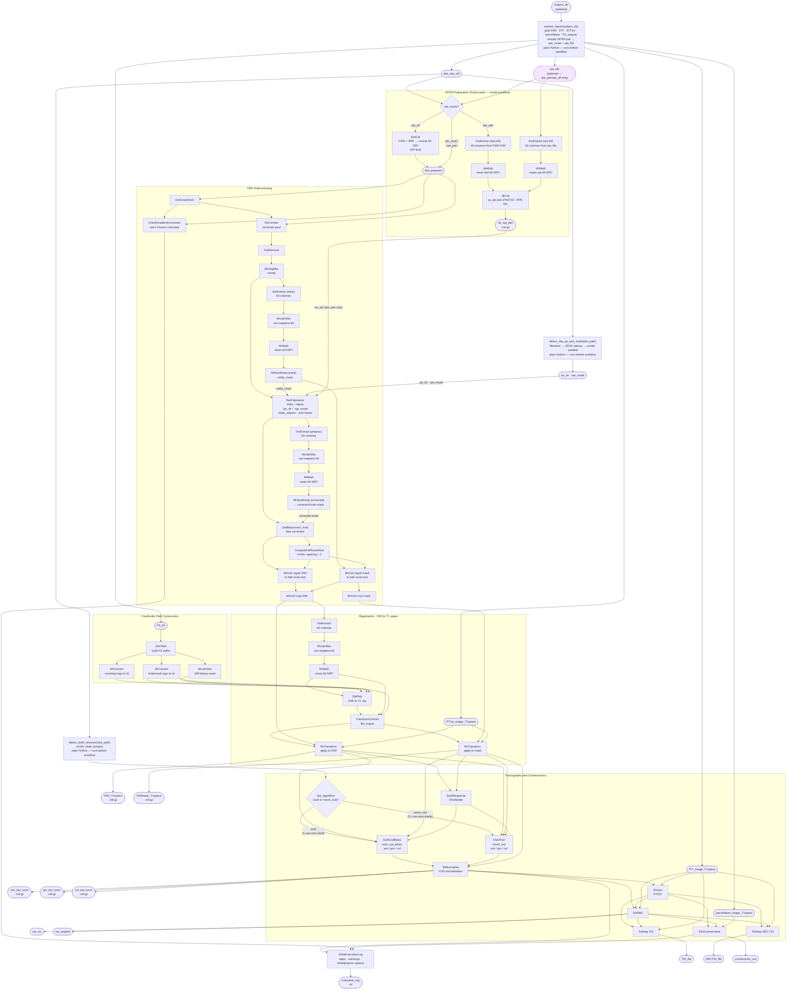

# DWI Analysis Pipeline



---

## Example Usage

### Minimal — subject directory (auto-discovery)

```python
import datetime
from dwi_analysis import DwiPipeline, resolve_inputs, detect_dwi_pe_and_mode, detect_shell_structure

subject_dir = "/data/subjects/100307"
output_path = "/data/output/100307"

inputs = resolve_inputs(subject_dir)
# inputs["dwi_raw_mif"]                  -> "/data/subjects/100307/100307_dwi_BATMAN_AP.mif.gz"
# inputs["rpe_file"]                     -> "/data/subjects/100307/100307_dwi_BATMAN_PA.mif.gz"  (or None)
# inputs["rpe_mode"]                     -> "rpe_pair" / "rpe_all" / "rpe_none"
# inputs["pe_dir"]                       -> "AP"
# inputs["FS_dir"]                       -> "/data/subjects/100307/FS_outputs"
# inputs["fTT_image_T1space"]            -> "/data/subjects/100307/100307_5TT_msmt.mif.gz"
# inputs["fTTvis_image_T1space"]         -> "/data/subjects/100307/100307_5TTvis_hsvs_T1space.mif.gz"
# inputs["parcellation_image_T1space"]   -> "/data/subjects/100307/100307_Parcellation_DK_T1space.mif.gz"

dwi_path = inputs["dwi_raw_mif"]

wf = DwiPipeline(
    **inputs,
    eddy_options="' --slm=linear'",
    fod_algorithm=detect_shell_structure(dwi_path),
    start_time=datetime.datetime.now().isoformat(timespec="seconds"),
    cache_root=output_path,
)
result = wf(cache_root=output_path, rerun=True)
```

---

### Manual override — explicit files, known PE direction

```python
wf = DwiPipeline(
    dwi_raw_mif="/data/subjects/100307/100307_dwi_BATMAN_AP.mif.gz",
    FS_dir="/data/subjects/100307/FS_outputs",
    fTTvis_image_T1space="/data/subjects/100307/100307_5TTvis_hsvs_T1space.mif.gz",
    fTT_image_T1space="/data/subjects/100307/100307_5TT_msmt.mif.gz",
    parcellation_image_T1space="/data/subjects/100307/100307_Parcellation_HCPMMP1_T1space.mif.gz",
    pe_dir="AP",
    rpe_mode="rpe_none",
    eddy_options="' --slm=linear'",
    fod_algorithm="msmt_csd",
    start_time=datetime.datetime.now().isoformat(timespec="seconds"),
    cache_root="/data/output/100307",
)
result = wf(cache_root="/data/output/100307", rerun=True)
```

---

### With RPE pair (topup + eddy)

```python
# resolve_inputs detects the PA file and sets rpe_mode="rpe_pair" automatically.
# Inside the workflow, DwiExtract+MrMath+MrCat build the 1+1 b0 se_epi pair.
wf = DwiPipeline(
    **resolve_inputs("/data/subjects/100307"),
    eddy_options="' --slm=linear --repol'",
    fod_algorithm=detect_shell_structure("/data/subjects/100307/100307_dwi_BATMAN_AP.mif.gz"),
    start_time=datetime.datetime.now().isoformat(timespec="seconds"),
    cache_root="/data/output/100307",
)
result = wf(cache_root="/data/output/100307", rerun=True)
```

---

### With full RPE series (rpe_all — equal volume counts AP + PA)

```python
# resolve_inputs detects equal-volume AP+PA → rpe_all automatically.
# Inside the workflow, DwiCat concatenates AP and PA into a single 4D series.
wf = DwiPipeline(
    **resolve_inputs("/data/subjects/100307"),
    eddy_options="' --slm=linear'",
    fod_algorithm=detect_shell_structure("/data/subjects/100307/100307_dwi_BATMAN_AP.mif.gz"),
    start_time=datetime.datetime.now().isoformat(timespec="seconds"),
    cache_root="/data/output/100307",
)
result = wf(cache_root="/data/output/100307", rerun=True)
```

---

### Batch — loop over subjects

```python
import datetime
from pathlib import Path
from dwi_analysis import DwiPipeline, resolve_inputs, detect_shell_structure

subjects_root = Path("/data/subjects")
output_root   = Path("/data/output")

for subject_dir in sorted(subjects_root.iterdir()):
    if not subject_dir.is_dir():
        continue
    output_path = str(output_root / subject_dir.name)
    try:
        inputs = resolve_inputs(str(subject_dir))
    except FileNotFoundError as e:
        print(f"  SKIP {subject_dir.name}: {e}")
        continue

    wf = DwiPipeline(
        **inputs,
        eddy_options="' --slm=linear'",
        fod_algorithm=detect_shell_structure(inputs["dwi_raw_mif"]),
        start_time=datetime.datetime.now().isoformat(timespec="seconds"),
        cache_root=output_path,
    )
    wf(cache_root=output_path, rerun=True)
```

---

## AP/PA preparation — what happens inside the workflow

| `rpe_mode`    | Pydra tasks added                                                                      | dwifslpreproc receives                              |
|---------------|----------------------------------------------------------------------------------------|-----------------------------------------------------|
| `rpe_none`    | none — `dwi_raw_mif` passes straight through                                           | `-rpe_none -pe_dir`                                 |
| `rpe_pair`    | `DwiExtract` (fwd b0) → `MrMath` (mean) + `DwiExtract` (rpe b0) → `MrMath` → `MrCat` | `-rpe_pair -se_epi <1+1 b0 pair> -align_seepi -pe_dir` |
| `rpe_all`     | `DwiCat` — concatenates `dwi_raw_mif` + `rpe_file` (AP first)                         | `-rpe_all -pe_dir`                                  |
| `rpe_header`  | none — PE info read from image header                                                  | `-rpe_header` (pe_dir and readout_time omitted)     |

---

## `resolve_inputs` classification — all input permutations

Abbreviations: **MS** = multi-shell (non-zero b-values present); **b0** = b0-only; **E** = equal volume counts; **U** = unequal volume counts; **tag** = PE direction from filename; **header** = PE direction inferred from mrinfo / JSON sidecar.

### A — Single file

| # | Files present | Phase | `dwi_raw_mif` | `rpe_file` | `pe_dir` | `rpe_mode` | |
|---|---------------|-------|---------------|------------|----------|------------|-|
| A1 | `dwi_AP.mif.gz` (MS) | 3 | `dwi_AP` | — | tag: AP | `rpe_none` | ✅ |
| A2 | `dwi_PA.mif.gz` (MS) | 3 | `dwi_PA` | — | tag: PA | `rpe_none` | ✅ unusual — PA-only series |
| A3 | `dwi.mif.gz` (MS, single PE in header) | 2 | `dwi` | — | header | `rpe_none` | ✅ |
| A4 | `dwi.mif.gz` (MS, interleaved AP+PA in header) | 2 | `dwi` | — | header (dominant dir) | `rpe_header` | ✅ |

---

### B — Both AP and PA tagged (same acquisition stem)

| # | Files present | Phase | `dwi_raw_mif` | `rpe_file` | `pe_dir` | `rpe_mode` | |
|---|---------------|-------|---------------|------------|----------|------------|-|
| B1 | `dwi_AP.mif.gz` (MS) + `dwi_PA.mif.gz` (b0) | 1 | `dwi_AP` | `dwi_PA` | tag: AP | `rpe_pair` | ✅ |
| B2 | `dwi_AP.mif.gz` (MS, E vols) + `dwi_PA.mif.gz` (MS, E vols) | 1 | `dwi_AP` | `dwi_PA` | tag: AP | `rpe_all` | ✅ |
| B3 | `dwi_AP.mif.gz` (MS, N vols) + `dwi_PA.mif.gz` (MS, U vols) | 1 | `dwi_AP` | `dwi_PA` | tag: AP | `rpe_pair` | ⚠️ volume mismatch — may need `rpe_split` (override manually) |
| B4 | `dwi_AP.mif.gz` (b0) + `dwi_PA.mif.gz` (b0) | 3 | `dwi_AP` (b0!) | — | tag: AP | `rpe_none` | ❌ Phase 1 skips b0 FWD; Phase 3 falls back to AP b0 as main — no true DWI present |
| B5 | `dwi_AP.mif.gz` (b0) + `dwi_PA.mif.gz` (MS) | 3 | `dwi_AP` (b0!) | — | tag: AP | `rpe_none` | ❌ Phase 1 skips b0 FWD; PA MS ignored — no untagged to rescue |

---

### C — Untagged main DWI + PE-tagged companion(s)

| # | Files present | Phase | `dwi_raw_mif` | `rpe_file` | `pe_dir` | `rpe_mode` | |
|---|---------------|-------|---------------|------------|----------|------------|-|
| C1 | `dwi.mif.gz` (MS) + `dwi_PA.mif.gz` (b0) | 2 | `dwi` | `dwi_PA` | header | `rpe_pair` | ✅ |
| C2 | `dwi.mif.gz` (MS, E vols) + `dwi_PA.mif.gz` (MS, E vols) | 2 | `dwi` | `dwi_PA` | header | `rpe_all` | ✅ |
| C3 | `dwi.mif.gz` (MS, N vols) + `dwi_PA.mif.gz` (MS, U vols) | 2 | `dwi` | `dwi_PA` | header | `rpe_pair` | ⚠️ volume mismatch — may need `rpe_split` |
| C4 | `dwi.mif.gz` (MS) + `dwi_AP_b0.mif.gz` (b0) + `dwi_PA_b0.mif.gz` (b0) | 2 | `dwi` | `dwi_PA_b0` | header | `rpe_pair` | ✅ AP b0 scout ignored |
| C5 | `dwi.mif.gz` (MS) + `dwi_AP_b0.mif.gz` (b0) only | 2 | `dwi` | — | header | `rpe_none` | ✅ AP b0 scout ignored (not an RPE companion) |

---

### D — Edge / ambiguous cases

| # | Files present | Phase | `dwi_raw_mif` | `rpe_file` | `pe_dir` | `rpe_mode` | |
|---|---------------|-------|---------------|------------|----------|------------|-|
| D1 | Two untagged MS files (different volume counts) | 2 | larger by vol count | — | header | `rpe_none` | ⚠️ smaller file silently ignored — check manually |
| D2 | `dwi.mif.gz` (untagged) + `dwi_AP.mif.gz` (MS) + `dwi_PA.mif.gz` (MS) | 1 | `dwi_AP` | `dwi_PA` | tag: AP | `rpe_all` or `rpe_pair` | ⚠️ untagged file ignored — Phase 1 finds the tagged pair first |

---

## DwiFslpreproc mode reference

| `rpe_mode`   | Condition                                                                | `rpe_file` required? |
|--------------|--------------------------------------------------------------------------|----------------------|
| `rpe_none`   | No reverse-PE image; eddy correction only                                | No                   |
| `rpe_pair`   | RPE is b0-only, or both MS but unequal volume counts                     | Yes                  |
| `rpe_all`    | Full DWI acquired in both PE directions with equal volume counts         | Yes                  |
| `rpe_header` | PE information embedded in image header (interleaved single-file series) | No                   |
