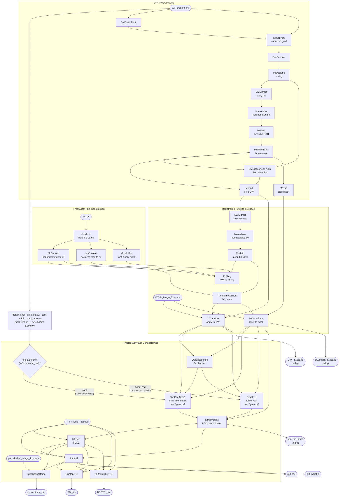

# DWI Analysis Pipeline

```mermaid
flowchart TD
    IN1([dwi_preproc_mif])
    IN2([FS_dir])
    IN3([fTTvis_image_T1space])
    IN4([fTT_image_T1space])
    IN5([parcellation_image_T1space])

    IN1 --> DETECT["detect_shell_structure(dwi_path)<br/>mrinfo -shell_bvalues<br/><i>plain Python — runs before workflow</i>"]
    DETECT --> FOD_CHOICE{"fod_algorithm<br/>(ss3t or msmt_csd)?"}

    subgraph PREPROC["DWI Preprocessing"]
        A[DwiGradcheck] --> B["MrConvert<br/>corrected grad"]
        IN1 --> A
        IN1 --> B
        B --> C[DwiDenoise]
        C --> D["MrDegibbs<br/>unring"]

        D --> E1["DwiExtract<br/>early b0"]
        E1 --> E2["MrcalcMax<br/>non-negative b0"]
        E2 --> E3["MrMath<br/>mean b0 NIfTI"]
        E3 --> E4["MriSynthstrip<br/>brain mask"]

        D --> F["DwiBiascorrect_Ants<br/>bias correction"]
        E4 --> F
        F --> G["MrGrid<br/>crop DWI"]
        E4 --> G
        E4 --> H["MrGrid<br/>crop mask"]
    end

    subgraph FS["FreeSurfer Path Construction"]
        IN2 --> I["JoinTask<br/>build FS paths"]
        I --> K["MrConvert<br/>brainmask.mgz to nii"]
        I --> M["MrConvert<br/>normimg.mgz to nii"]
        I --> Q["MrcalcMax<br/>WM binary mask"]
    end

    subgraph REG["Registration - DWI to T1 space"]
        G --> N["DwiExtract<br/>b0 volumes"]
        N --> O["MrcalcMax<br/>non-negative b0"]
        O --> P["MrMath<br/>mean b0 NIfTI"]
        P --> R["EpiReg<br/>DWI to T1 reg"]
        M --> R
        K --> R
        Q --> R
        R --> S["TransformConvert<br/>flirt_import"]
        P --> S
        K --> S
        S --> T["MrTransform<br/>apply to DWI"]
        G --> T
        IN3 --> T
        S --> U["MrTransform<br/>apply to mask"]
        H --> U
        IN3 --> U
    end

    subgraph TRACT["Tractography and Connectomics"]
        T --> V["Dwi2Response<br/>Dhollander"]
        U --> V

        FOD_CHOICE -- "ss3t<br/>(1 non-zero shell)" --> W1["Ss3tCsdBeta1<br/>ss3t_csd_beta1<br/>wm / gm / csf"]
        FOD_CHOICE -- "msmt_csd<br/>(2+ non-zero shells)" --> W2["Dwi2Fod<br/>msmt_csd<br/>wm / gm / csf"]
        T --> W1
        U --> W1
        V --> W1
        T --> W2
        U --> W2
        V --> W2

        W1 --> X["MtNormalise<br/>FOD normalisation"]
        W2 --> X
        U --> X
        X --> Y["TckGen<br/>iFOD2"]
        IN4 --> Y
        X --> Z[TckSift2]
        Y --> Z
        IN4 --> Z
        Y --> AA[Tck2Connectome]
        Z --> AA
        IN5 --> AA
        Y --> AB["TckMap TDI"]
        Z --> AB
        IN4 --> AB
        Y --> AC["TckMap DEC-TDI"]
        Z --> AC
        IN4 --> AC
    end

    T --> OUT1([DWI_T1space<br/>.mif.gz])
    U --> OUT2([DWImask_T1space<br/>.mif.gz])
    X --> OUT3([wm_fod_norm<br/>.mif.gz])
    AB --> OUT4([TDI_file])
    AC --> OUT5([DECTDI_file])
    AA --> OUT6([connectome_out])
    Z --> OUT7([out_mu])
    Z --> OUT8([out_weights])
```
